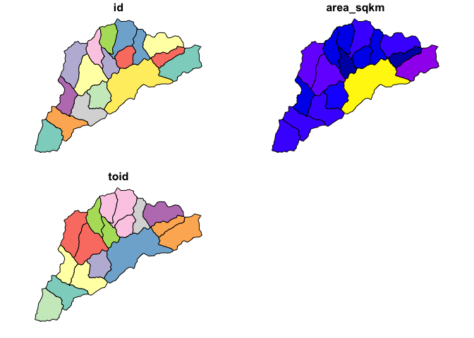
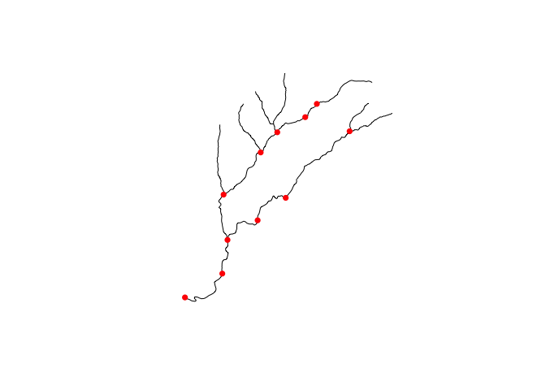
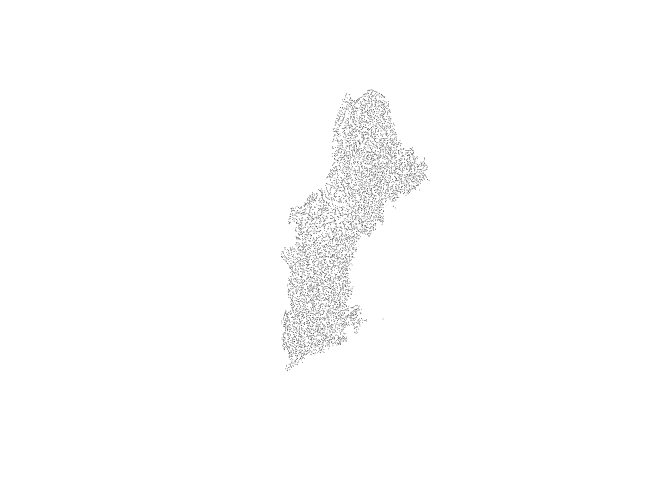

<!-- README.md is generated from README.Rmd. Please edit that file -->

# hyRelease

`hyRelease` generates release hydrofabric artifacts for use in NextGen.
The types of data in each release is actively being discussed
[here](https://github.com/mikejohnson51/hyRelease/issues/4).

For now, we are generating releases for HUC01 units and CAMELS basins.
These are stored in a Lynker Technologies AWS bucket. If you have
credentials to these, data can be accessed in a number of ways.

A general approach (implemented in R, but general in nature) in the
following way for an example CAMELS basin draining to NWIS gage
`01435000`.

### Set up Credentials

In order to connect to S3, you need to authenticate. One way easiest
method is to set environment variables in a working session like this:

``` r
Sys.setenv("AWS_ACCESS_KEY_ID"     = "XXXXX",
           "AWS_SECRET_ACCESS_KEY" = "XXXXX",
           "AWS_DEFAULT_REGION"    = "us-east-2")
```

Or sourcing it from a private file:

``` r
source("private/aws.R")
```

Or setting them to the root of your system.

However you authenticate, our resources are stored in `us-east-2` but
your access key IDs and secrets are individual.

## Getting data!

For NGEN applications a number of file formats are needed including CSV,
JSON, geoJSON, and gpkg. The first three of these are files that can be
read directly, while a gpkg has some intereesting database capabilites.

### Read files

First, lets see what files are in our CAMEL “bucket”. AWS does not have
an explict folder structure so files are defined by a bucket, and can be
reduced by the file prefix. So, lets first find the files in the
CAMELS/gage_0143500 “directory”.

``` r
library(aws.s3)
library(data.table)
library(dplyr)

rbindlist(get_bucket(bucket = "formulations-dev", prefix = "CAMELS/gage_01435000"))$Key
#>  [1] "CAMELS/gage_01435000/"                                 
#>  [2] "CAMELS/gage_01435000/crosswalks/"                      
#>  [3] "CAMELS/gage_01435000/crosswalks/crosswalk-mapping.json"
#>  [4] "CAMELS/gage_01435000/graph/"                           
#>  [5] "CAMELS/gage_01435000/graph/catchment_edge_list.json"   
#>  [6] "CAMELS/gage_01435000/graph/flowpath_edge_list.json"    
#>  [7] "CAMELS/gage_01435000/graph/waterbody_edge_list.json"   
#>  [8] "CAMELS/gage_01435000/parameters/"                      
#>  [9] "CAMELS/gage_01435000/parameters/camels.csv"            
#> [10] "CAMELS/gage_01435000/parameters/nwm.csv"               
#> [11] "CAMELS/gage_01435000/parameters/waterbody-params.json" 
#> [12] "CAMELS/gage_01435000/spatial/"                         
#> [13] "CAMELS/gage_01435000/spatial/catchment_data.geojson"   
#> [14] "CAMELS/gage_01435000/spatial/flowpath_data.geojson"    
#> [15] "CAMELS/gage_01435000/spatial/hydrofabric.gpkg"         
#> [16] "CAMELS/gage_01435000/spatial/nexus_data.geojson"
```

Onec we know what files are avaialble, we can read any of them by
selecting the correct driver:

#### CSV

The pattern for reading files is identical regardless of format, the
correct reader simply needs to be defined:

``` r
csv_data = s3read_using(fread, object = "s3://formulations-dev/CAMELS/gage_01435000/parameters/nwm.csv")
glimpse(csv_data)
#> Rows: 17
#> Columns: 13
#> $ ID                             <chr> "cat-1", "cat-10", "cat-11", "cat-12", …
#> $ gw_Coeff                       <dbl> 0.005, 0.005, 0.005, 0.005, 0.005, 0.00…
#> $ gw_Zmax                        <dbl> 34.75653, 241.20125, 241.20125, 154.072…
#> $ gw_Expon                       <int> 1, 6, 6, 3, 6, 1, 6, 6, 3, 6, 3, 3, 3, …
#> $ `sp_bexp_soil_layers_stag=1`   <int> 3, 4, 4, 3, 4, 3, 4, 4, 3, 4, 3, 3, 3, …
#> $ `sp_dksat_soil_layers_stag=1`  <dbl> 1.651e-06, 5.490e-06, 4.064e-06, 4.625e…
#> $ `sp_psisat_soil_layers_stag=1` <dbl> 0.7590000, 0.4473704, 0.4573333, 0.4573…
#> $ `sp_smcmax_soil_layers_stag=1` <dbl> 0.5700271, 0.4202248, 0.4217215, 0.4265…
#> $ `sp_smcwlt_soil_layers_stag=1` <dbl> 0.08400000, 0.07142511, 0.07182244, 0.0…
#> $ sp_slope                       <dbl> 0.06858038, 0.06552054, 0.07023233, 0.0…
#> $ wf_IVGTYP                      <int> 11, 15, 11, 15, 11, 11, 11, 11, 11, 11,…
#> $ wf_ISLTYP                      <int> 4, 6, 6, 6, 6, 4, 6, 6, 4, 4, 4, 4, 6, …
#> $ fd_LKSATFAC                    <dbl> 986.9935, 1511.3626, 1683.4473, 1090.86…
```

#### JSON

``` r
library(jsonlite)

json_data = s3read_using(read_json, object = "s3://formulations-dev/CAMELS/gage_01435000/parameters/waterbody-params.json", simplifyVector = TRUE)
glimpse(json_data[[1]])
#> Rows: 1
#> Columns: 21
#> $ lengthMap    <chr> "4147956.1"
#> $ toID         <int> 100000018
#> $ Hydroseq     <int> 1
#> $ member_COMID <list> "4147956"
#> $ LevelPathID  <int> 1
#> $ length_km    <dbl> 5.0756
#> $ areasqkm     <dbl> 11.4347
#> $ gages        <chr> "01435000"
#> $ Qi           <int> 0
#> $ MusK         <int> 3600
#> $ MusX         <dbl> 0.2
#> $ n            <dbl> 0.055
#> $ So           <dbl> 0.006
#> $ ChSlp        <dbl> 0.36
#> $ BtmWdth      <dbl> 8.608
#> $ time         <int> 0
#> $ Kchan        <int> 0
#> $ nCC          <dbl> 0.11
#> $ TopWdthCC    <dbl> 43.041
#> $ TopWdth      <dbl> 14.347
#> $ Length_m     <dbl> 5075.585
```

### geoJSON

``` r
library(sf)

## READ from geoJSON
cat_data = s3read_using(read_sf, object = "s3://formulations-dev/CAMELS/gage_01435000/spatial/catchment_data.geojson")
plot(cat_data)
```



### Geopackage

``` r
## READ from GPKG
### find available layers
s3read_using(st_layers, object = "s3://formulations-dev/CAMELS/gage_01435000/spatial/hydrofabric.gpkg")
#> Driver: GPKG 
#> Available layers:
#>   layer_name geometry_type features fields
#> 1 catchments       Polygon       17      3
#> 2  flowpaths   Line String       17      7
#> 3      nexus         Point       11      2

### call flowpaths layer
fp_data = s3read_using(st_read, object = "s3://formulations-dev/CAMELS/gage_01435000/spatial/hydrofabric.gpkg", "flowpaths")
#> Reading layer `flowpaths' from data source 
#>   `/private/var/folders/jc/ys3x7k814b9dnx208718f07m0000gn/T/RtmpSSuWOR/filea92274758c4c.gpkg' 
#>   using driver `GPKG'
#> Simple feature collection with 17 features and 7 fields
#> Geometry type: LINESTRING
#> Dimension:     XY
#> Bounding box:  xmin: 1746257 ymin: 2294474 xmax: 1763585 ymax: 2313553
#> Projected CRS: NAD83 / Conus Albers


### plot and add nexus layer
{
  plot(fp_data$geom)
  plot(s3read_using(st_read, object = "s3://formulations-dev/CAMELS/gage_01435000/spatial/hydrofabric.gpkg", "nexus"), add = TRUE, pch = 16, col = "red")
}
```



    #> Reading layer `nexus' from data source 
    #>   `/private/var/folders/jc/ys3x7k814b9dnx208718f07m0000gn/T/RtmpSSuWOR/filea922514e0d4f.gpkg' 
    #>   using driver `GPKG'
    #> Simple feature collection with 11 features and 2 fields
    #> Geometry type: POINT
    #> Dimension:     XY
    #> Bounding box:  xmin: 1746257 ymin: 2294798 xmax: 1760023 ymax: 2310979
    #> Projected CRS: NAD83 / Conus Albers

## Super cool!

Because gpkgs are SQLite databases we can pass queries to the resource
to extract exactly the features we need. For example, if we want to pull
the just the junction nexus locations, we can do so.

``` r
junction_nex =  sf::st_read(
    dsn = "/vsis3/formulations-dev/hydrofabric/CONUS-hydrofabric/ngen-release/01a/2021-10-22/hydrofabric.gpkg",
    query = "SELECT * FROM nexus WHERE nexus_type == 'junction'")
#> Reading query `SELECT * FROM nexus WHERE nexus_type == 'junction'' from data source `/vsis3/formulations-dev/hydrofabric/CONUS-hydrofabric/ngen-release/01a/2021-10-22/hydrofabric.gpkg' 
#>   using driver `GPKG'
#> Simple feature collection with 7401 features and 3 fields
#> Geometry type: POINT
#> Dimension:     XY
#> Bounding box:  xmin: 1827668 ymin: 2222999 xmax: 2242913 ymax: 3012187
#> Projected CRS: NAD83 / Conus Albers


plot(junction_nex$geom, pch = 16, cex = .1)
```



NOTE: The `/vsis3/` path prefix allows us to access the gpkg as a
virtual dataset though GDALs
[capabilites](https://gdal.org/user/virtual_file_systems.html)
